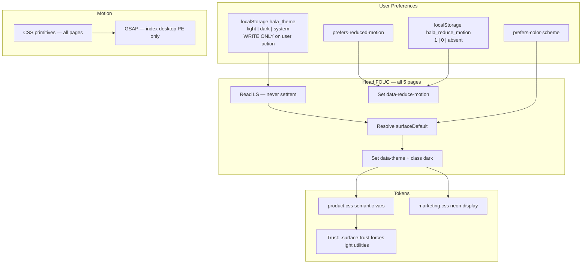
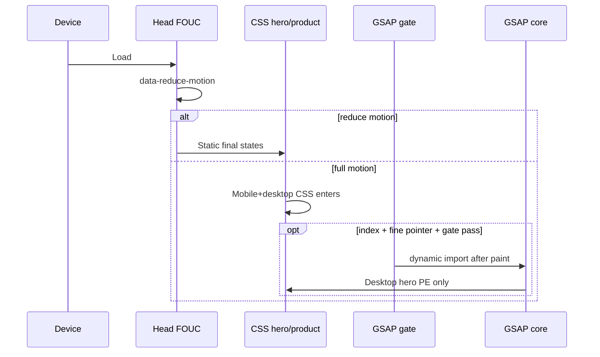
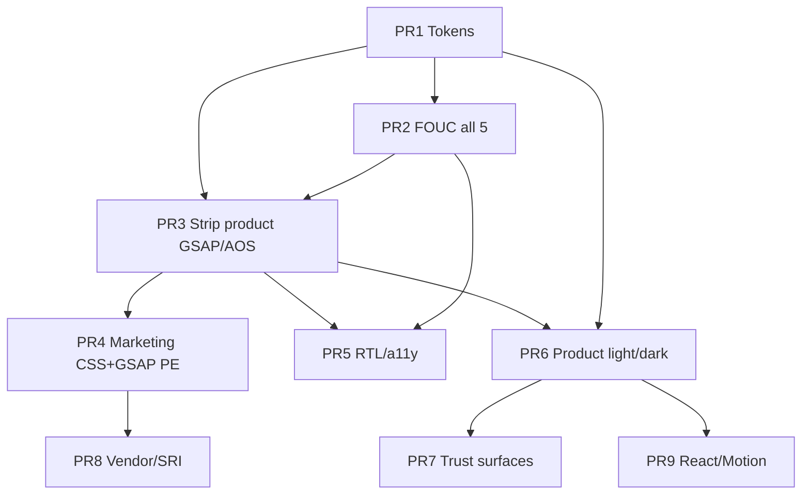

# Design Decision: Ideal UI/UX Theme & Animation Library for Hala AI OS

| Field | Value |
| --- | --- |
| **Document title** | Hala AI OS — Theme Strategy (Light/Dark/Hybrid) & Animation Library Policy |
| **Author** | Systems Architecture / Design Engineering |
| **Date** | 2026-07-12 |
| **Status** | Draft (Rev 2.1 — re-review snippet contracts fixed) |
| **Product** | Hala AI OS (هالة) — B2B SaaS for Saudi e-commerce merchants |
| **Workspace baseline** | `C:\Users\shssk\Downloads\h\` (`index.html`, `dashboard.html`, `onboarding.html`, `results.html`, `scanner.html`, `style.css`) |
| **Audience** | Senior engineers, product, design |

---

## Executive Recommendation

**Decide once, implement incrementally, measure on mid-range Android.**

### Theme (one-sentence policy)

**Surface-specific hybrid with dual user control:** marketing stays **dark-default + light optional**; the product app is **light-default + dark optional**; **money/trust surfaces force high-clarity light panels** even when chrome is dark; preference is **`light` | `dark` | `system`** in `hala_theme`, **never written on page load** — only on explicit user action.

| Surface | Default (key absent) | Override | Rationale |
| --- | --- | --- | --- |
| Marketing / landing (`index.html`) | **Dark** | light / dark / system | AI brand; existing neon system |
| Product shell (`dashboard.html`) | **Light** | light / dark / system | Daylight, forms, admin trust |
| Onboarding / OAuth / permissions | **Light** | inherit product | Bank-adjacent consent UX |
| Scanner / AI progress | **Light** | inherit product | Status clarity > theatrical dark |
| Results / loss report | **Light** | inherit product | Trust for SAR-adjacent claims |
| Billing, KYC, invoices, ZATCA/VAT | **Forced trust surface (light field)** | Nested in any chrome | Money legibility non-negotiable |

### Animation (one-sentence policy)

**CSS-first everywhere (especially mobile marketing); strip GSAP+AOS from product routes immediately; marketing GSAP is desktop progressive enhancement only after CSS hero parity; no Motion until React; hard budgets for mid-range devices.**

| Layer | Target library | Current debt (must remove) |
| --- | --- | --- |
| (a) Marketing (`index.html`) | **CSS mobile-first + GSAP core desktop-only PE** | GSAP + AOS CDNs; continuous ticker on all devices |
| (b) Product (`dashboard.html`, `onboarding.html`) | **CSS-only — 0KB third-party** | **Both pages currently load GSAP 3.12.5 + AOS 2.3.4** and run enter timelines + `gsap.ticker` |
| (c) Scanner / results | **CSS + page JS** (already 0KB libs) | Timing/a11y debt only (`aria-live`, reduced-motion counters, RTL enter) |

**Critical correction:** “0KB product animation libs” is a **removal project**, not a freeze. Violators today: `dashboard.html`, `onboarding.html`. Early PR strips them (see PR Plan).

### Why this hybrid

1. **KSA is mobile-first and sun-bright** — smartphones dominate usage; bright ambient light punishes dense dark B2B UIs.
2. **Two-speed device market** — peak Mbps ≠ smooth main-thread; JS parse/animation cost dominates mid-range Android.
3. **Trust ≠ neon** for money/permissions; fintech clarity for mada/BNPL/VAT mental models.
4. **Brand still needs AI wow on acquisition** — dark marketing differentiates from Salla/Zid greys.
5. **Code already splits surfaces badly** — three+ palettes, dark default written into `localStorage` on first visit, GSAP on product routes. This doc makes the hybrid intentional and implementable.

### Non-negotiables

- Arabic-first, real RTL (`dir="rtl" lang="ar"`), IBM Plex Sans Arabic.
- `prefers-reduced-motion` + FOUC-class `data-reduce-motion` + in-app “تقليل الحركة” via static tri-state stand-in (header/footer/popover; full Settings optional).
- Performance budgets + **file-level CI greps** for product GSAP/AOS.
- Animation never sole status channel (`aria-live` on scan/results).
- Theme **persist only on user toggle**; FOUC never `setItem`.

---

## Overview

Hala AI OS helps Saudi merchants detect and fix store “loss” with AI. The static shell ships **dark-first marketing** (space black, neon cyan/teal, GSAP+AOS), **product pages that also ship GSAP+AOS** (`dashboard.html`, `onboarding.html`), light-leaning scanner/results without theme bootstrap, and a fragmented token system (`:root`, `landing-dark`, `data-theme` overrides, per-page Tailwind hex dumps, runtime platform brand vars).

This document decides theme strategy, animation strategy, normative FOUC/persistence contracts, token consolidation, RTL/a11y recipes, and a reordered PR plan engineers can execute.

---

## Background & Motivation

### Current state (codebase facts — verified)

| File | Theme behavior | Animation (verified) |
| --- | --- | --- |
| `index.html` | FOUC: `hala_theme \|\| "dark"`; `applyTheme` **always `setItem`**; binary toggle; `body.landing-dark` always; dual aurora | **GSAP 3.12.5 + AOS 2.3.4** CDN; hero stagger/split-line; **continuous `gsap.ticker` parallax**; AOS on features/trial |
| `dashboard.html` | FOUC + `applyTheme` same dark-persist pattern; `class="dark"`; Tailwind **light Material** hex (`surface: #f7f9fb`) — semantic conflict; platform brand runtime `--primary` overrides | **GSAP + AOS loaded and used**: `gsap-dash-card`, `gsap.from` side-nav/title/cards, **`gsap.ticker` on stats**, `data-aos` panels; counters rAF **1600ms** without reduced-motion short-circuit |
| `onboarding.html` | FOUC + dark-persist; surfaces look light Material; platform colors | **GSAP + AOS**: panel/title/platform card enter + **ticker parallax** on `#platform-grid .parallax-card` |
| `scanner.html` | **No FOUC / no theme bootstrap**; light chrome | CSS only; `#status-text` **no `aria-live`**; `.scan-log-item` LTR `translateX(-8px)` |
| `results.html` | **No FOUC / no theme bootstrap**; light severity cards | CSS stagger delays **100–500ms**; money `#counter` animates without reduced-motion skip |
| `style.css` | **≥5 palette layers**: `:root` vars; `body.landing-dark` neon block; large `html[data-theme="light"]` override forest; glass tokens; fragile `html[data-theme] .bg-background` class-name overrides | Many keyframes; partial `prefers-reduced-motion`; `.gsap-*` / AOS helper rules |

### Pain points

1. **Five parallel palettes** + per-page Tailwind CDN hex dumps (e.g. surface `#f4f7f9` vs `#f7f9fb`).
2. **GSAP+AOS on 3 of 5 pages** (index, dashboard, onboarding) — not marketing-only.
3. **FOUC + `applyTheme` write `"dark"` on first visit** to index/dashboard/onboarding → product light-default can never apply afterward.
4. **Incomplete funnel theming:** scanner/results ignore `hala_theme`.
5. **Incomplete a11y:** partial reduced-motion; no motion FOUC; scanner status not live; counters ignore reduce on dashboard/results.
6. **RTL motion bugs:** scan log physical left enter; GSAP `x: 40` side-nav; marquee physical X.
7. **Token override anti-pattern:** string-matching Tailwind class names in CSS under `data-theme`.

### Why decide now

Lock FOUC contracts, strip product animation debt early, and consolidate tokens before more page-local forks land.

---

## Goals & Non-Goals

### Goals

- Normative theme resolver + **no persist on load** on all five HTML entrypoints.
- Surface defaults: marketing dark / product light; trust locks for money.
- Dual-theme tokens with **consolidation plan** and optional CSS split packaging.
- Animation: remove product GSAP/AOS; marketing CSS-first mobile + desktop GSAP PE.
- Implementable RTL, reduced-motion, and trust-surface recipes (snippets + DOM targets).
- Reordered PR plan with acceptance criteria (grep, timings, a11y).

### Non-Goals

- Full brand illustration redesign.
- Choosing React now (only note Motion dependency).
- Implementing PRs in this doc.
- Backend scan pipeline design.

---

## User & Market Research Synthesis

> **Evidence note:** Market and network figures below are **indicative** (order-of-magnitude, multi-source industry context supplied in the design brief). They facilitate prioritization; they are **not** audited citations. Weighted decision matrices are **facilitation tools**, not scientific rankings. Prefer primary sources before external investor claims.

### Saudi e-commerce & merchants (indicative)

- KSA e-commerce scale commonly cited **USD ~15–31B** (varies by source/year); strong double-digit CAGR; Vision 2030 digital push.
- ~**99%** internet penetration; cellular **49M+** (2024 context).
- **Mobile-first:** app browsing often **>65%**; smartphones ~**78%** of B2C e-comm revenue (Mordor 2025 context); CST: **>98%** of internet usage on smartphones.
- Young population (~**67%** under 35); high social commerce.
- **Salla** / **Zid** dominate SME enablement; Arabic-first admin is table stakes; SME operators often 22–45, digitally fluent.
- Merchant loops: orders, **mada**/wallets/BNPL (**Tamara/Tabby**), inventory — often on phone.

**Implication:** design for **phone, Arabic RTL, intermittent attention, money-adjacent anxiety**, outdoor/shop brightness.

### Network / performance (indicative — Opensignal Feb 2026 context)

KSA described as **two-speed**: world-class networks, **device-limited** experience.

| Segment | Download (approx.) | Note |
| --- | --- | --- |
| High-end | ~**207 Mbps** | Peak-class |
| All devices | ~**121 Mbps** | **~86 Mbps gap** |
| ECQ high-end / all | ~**69.7% / ~63.6%** | Consistency < peak |

**Implication:** optimize **mid-range Android** main-thread/JS parse. Rule of thumb: **~1KB JS ≈ ~2ms parse** (order-of-magnitude).

### Theme / trust (UX industry patterns)

| Mode | Strengths | Weaknesses for Hala |
| --- | --- | --- |
| Light | Trust, forms, bright ambient | Less AI “premium” on marketing |
| Dark | AI/tech aesthetic, dim triage | Dense B2B + money trust risk if neon |
| Hybrid | Marketing wow + product clarity | Maintenance cost (mitigate with split CSS) |
| System + override | SaaS baseline | Needs complete dual tokens |

### Animation libraries (approx 2025–2026, indicative gzip)

| Approach | Bundle | Strengths | Weaknesses |
| --- | --- | --- | --- |
| CSS-only | ~0–5KB | Best LCP/INP, mid-range safe | Complex timelines hard |
| Motion | ~2.6–46KB | React DX | React-only |
| GSAP core | ~23KB | Timelines, framework-agnostic | Heavy for CRUD; main-thread if ticker |
| Hybrid | CSS + selective | Best cost/quality | Discipline |

### Trust factors (Saudi merchants)

Arabic-first RTL; money/order/refund/VAT clarity; fintech-adjacent credibility vs neon-crypto; **performance = trust**; no gamification on financial surfaces.

---

## Theme Decision Matrix

Scores **1–5** are facilitation aids. Weights are judgmental.

| Criterion (weight) | Fixed Light | Fixed Dark | Auto only | Light def + dark opt | Dark def + light opt | Hybrid mono-CSS | **Hybrid + split CSS** |
| --- | --- | --- | --- | --- | --- | --- | --- |
| Trust / finance (1.2) | 5 | 2 | 4 | 5 | 3 | 5 | **5** |
| Sun / mobile daylight (1.3) | 5 | 2 | 4 | 5 | 3 | 5 | **5** |
| AI brand (1.0) | 2 | 5 | 3 | 3 | 5 | 5 | **5** |
| Night eye strain (0.8) | 2 | 5 | 4 | 4 | 5 | 4 | **4** |
| Dual-theme maintenance (1.0) | 5 | 5 | 2 | 3 | 3 | **2** | **4** |
| Competitor admin fit (0.9) | 5 | 2 | 3 | 5 | 2 | 4 | **4** |
| Codebase investment fit (0.7) | 2 | 4 | 2 | 3 | 4 | 5 | **4** |
| **Weighted total (approx.)** | ~33 | ~28 | ~29 | ~35 | ~31 | ~37 | **~39** |

**Winner: surface hybrid with split CSS packaging** (`marketing.css` + `product.css` or equivalent entrypoints) — same product policy as mono hybrid, **higher maintenance score** because neon override forest does not load on product routes.

Hybrid mono-CSS still valid short-term during migration; target packaging is split (KD-17).

Matrices are **not** precise science; hybrid wins because acquisition brand + product trust outweigh maintenance **if** split/consolidation lands.

---

## Animation Decision Matrix

| Criterion (weight) | CSS-only | GSAP everywhere | Motion everywhere | **CSS + product strip + marketing GSAP desktop PE** |
| --- | --- | --- | --- | --- |
| Mid-range main-thread (1.4) | 5 | 2 | 2 | **5** |
| Bundle cost (1.3) | 5 | 2 | 3 | **5** |
| Marketing wow **mobile** (1.0) | 4 | 3* | 3* | **4** (CSS is primary) |
| Marketing wow **desktop** (0.6) | 2 | 5 | 4 | **5** |
| Product CRUD fit (1.2) | 5 | 2 | 4 | **5** |
| Static HTML fit (1.1) | 5 | 5 | 1 | **5** |
| RTL + reduced-motion control (0.9) | 4 | 3 | 4 | **4** |
| Maintenance (0.8) | 5 | 3 | 3 | **4** |

\*GSAP/Motion “wow” does not help if gated off phones or never shipped on React.

**Winner: CSS-first + strip product libs + GSAP as desktop progressive enhancement on marketing only.**

---

## Proposed Design

### Architecture overview



### Theme application matrix (implementability)

| Concern | Source of truth | Mechanism | Notes |
| --- | --- | --- | --- |
| User preference | `localStorage.hala_theme` | `light` \| `dark` \| `system` \| **absent** | **Absent ≠ write default** |
| Resolved theme | `html[data-theme="light\|dark"]` | FOUC + runtime resolver | Always concrete light/dark on DOM |
| Tailwind dark variant | `html.dark` class | Synced 1:1 with resolved dark | `darkMode: "class"` |
| Shell identity | **`html[data-shell]` only** | Static attribute on `<html>`; FOUC + `HalaTheme` read **only** this | **Never** `body.dataset.shell` — single owner (KD-16) |
| Marketing neon chrome | Prefer `html[data-shell="marketing"][data-theme="dark"]` scope; optional `body.landing-dark` class synced by apply | **Only when marketing + resolved dark** | Class is derived, not a second source of truth |
| Product surfaces | CSS semantic vars **and/or** Tailwind mapped to vars | After PR1/PR6 path | Until vars wired, product dark is tokens-only / incomplete |
| Trust / money blocks | `data-surface="trust"` or `.surface-trust` | Forces light field tokens **+** utility resets for children | Works even if `html.dark` |
| Platform brand (Salla/Zid/Trendyol) | Runtime `--primary*` only | Accent for logos/CTAs | Must not redefine `--bg` / trust surfaces |

**Precedence when attributes disagree:**

1. Trust surface (innermost) wins for subtree colors.
2. Resolved `data-theme` + `class="dark"` must always agree (single writer: `HalaTheme.apply`).
3. Marketing neon: `shell === "marketing" && resolved === "dark"` where `shell = document.documentElement.getAttribute("data-shell")`. Sync `body.classList.toggle("landing-dark", …)` **only as a derived mirror** for legacy selectors; long-term scope neon under `html[data-shell="marketing"][data-theme="dark"]` so head FOUC does not need `body`.
4. Platform brand vars override **brand accents only**, never surface/fg on trust blocks.

### Theme mode policy (normative)

#### Storage

| Key | Values | When written |
| --- | --- | --- |
| `hala_theme` | `light` \| `dark` \| `system` | **Only** explicit user toggle or Settings save |
| `hala_reduce_motion` | `1` \| `0` | **Only** explicit Settings toggle |

#### Surface defaults (key **absent**)

| `data-shell` | Default resolved theme |
| --- | --- |
| `marketing` (`index.html`) | `dark` |
| `product` (dashboard, onboarding, scanner, results) | `light` |

#### FOUC head contract (identical snippet on **all five** pages)

**Shell ownership (normative):** `data-shell` lives **only on `<html>`**. FOUC, `HalaTheme`, and CSS must not read `body.dataset.shell`.

Neon scoping strategy (preferred, FOUC-safe without waiting for `body`):

```css
/* Target: migrate body.landing-dark rules to this compound selector */
html[data-shell="marketing"][data-theme="dark"] { /* marketing neon tokens */ }
```

Legacy bridge: if selectors still use `body.landing-dark`, `HalaTheme.syncLandingDark()` (and a post-body microtask in FOUC) mirrors the class from `html[data-shell]` + resolved theme.

```html
<script>
(function () {
  var root = document.documentElement;
  var shell = root.getAttribute("data-shell") || "product";
  var surfaceDefault = shell === "marketing" ? "dark" : "light";
  var pref = null;
  try { pref = localStorage.getItem("hala_theme"); } catch (e) {}
  var resolved;
  if (pref === "light" || pref === "dark") {
    resolved = pref;
  } else if (pref === "system") {
    resolved = matchMedia("(prefers-color-scheme: dark)").matches ? "dark" : "light";
  } else {
    // key absent — do NOT localStorage.setItem
    resolved = surfaceDefault;
  }
  root.setAttribute("data-theme", resolved);
  root.classList.toggle("dark", resolved === "dark");
  // Motion FOUC
  var reduce = false;
  try {
    if (localStorage.getItem("hala_reduce_motion") === "1") reduce = true;
    else if (localStorage.getItem("hala_reduce_motion") === "0") reduce = false;
    else reduce = matchMedia("(prefers-reduced-motion: reduce)").matches;
  } catch (e) {
    reduce = matchMedia("(prefers-reduced-motion: reduce)").matches;
  }
  root.setAttribute("data-reduce-motion", reduce ? "1" : "0");
  // NEVER setItem here. NEVER add theme-animating here.
  // landing-dark: body may not exist yet — schedule mirror only
  function syncLandingDark() {
    if (!document.body) return;
    document.body.classList.toggle(
      "landing-dark",
      shell === "marketing" && resolved === "dark"
    );
  }
  if (document.body) syncLandingDark();
  else document.addEventListener("DOMContentLoaded", syncLandingDark, { once: true });
})();
</script>
```

Markup per page:

```html
<html dir="rtl" lang="ar" data-shell="marketing|product" data-theme="..." class="...">
<!-- data-shell ONLY here — do not put data-shell on <body> -->
```

#### Runtime API

```js
// theme.js — shared
const HalaTheme = {
  getShell() {
    return document.documentElement.getAttribute("data-shell") || "product";
  },
  getPreferred() { /* light|dark|system|null if absent */ },
  resolve() {
    // uses FOUC algorithm with getShell(); never writes storage
  },
  syncLandingDark(resolved) {
    const shell = this.getShell();
    const darkMarketing = shell === "marketing" && resolved === "dark";
    if (document.body) {
      document.body.classList.toggle("landing-dark", darkMarketing);
    }
    // Preferred long-term: CSS keys off html[data-shell][data-theme] only
  },
  apply(theme, { persist = false, animate = false } = {}) {
    // 1) resolve concrete light|dark (if theme === "system", use matchMedia)
    // 2) set html data-theme + classList.toggle("dark", …)
    // 3) ALWAYS call syncLandingDark(resolved)  // required — not optional
    // 4) if persist && user action → localStorage.setItem("hala_theme", theme)
    // 5) if animate → temporary theme-animating (toggle only, not first paint)
  },
  setReduceMotion(on, { persist = false } = {}) {
    document.documentElement.setAttribute("data-reduce-motion", on ? "1" : "0");
    if (persist) localStorage.setItem("hala_reduce_motion", on ? "1" : "0");
  },
  subscribeSystem(handler) {
    // when preferred === "system", listen to prefers-color-scheme changes → apply(..., { persist: false })
  }
};
```

#### Static-shell preference UI (no full Settings app required)

The workspace has **no `settings.html`**. Tri-state theme + motion prefs must still ship without inventing a full settings IA.

**v1 static stand-in (normative — pick one package and use on all shells):**

| Control | Marketing (`index.html`) | Product (dashboard, onboarding; scanner/results minimal) |
| --- | --- | --- |
| Theme | Header **segmented control** or `<select>`: `فاتح` / `داكن` / `تلقائي` → `light` \| `dark` \| `system` | Same control in top bar **or** compact “المظهر” popover |
| Motion | Footer or popover checkbox **تقليل الحركة** | Same in popover / top-bar overflow |

Optional later: `settings.html` stub that hosts the same two controls. **Binary-only sun/moon toggle is non-compliant** with `system`.  
On change: `HalaTheme.apply(value, { persist: true, animate: true })` or `setReduceMotion(…, { persist: true })`.

#### System + marketing default truth table

| `hala_theme` | OS `prefers-color-scheme` | Shell | Resolved |
| --- | --- | --- | --- |
| **absent** | light | marketing | **dark** (surface default) |
| **absent** | dark | marketing | **dark** |
| **absent** | light | product | **light** |
| **absent** | dark | product | **light** (surface default, not OS) |
| `system` | light | either | **light** |
| `system` | dark | either | **dark** |
| `light` / `dark` | any | either | stored value |

Acquisition intent (marketing dark when unset) **beats** OS until user chooses `system` or light.

#### Cross-app shared pref

If user sets **dark** on marketing, product resolves **dark** (shared key). Money nested blocks still use **trust surfaces** (light field) inside dark chrome.

---

### Design token strategy

#### Five layers today → target two packages

| Today | Fate |
| --- | --- |
| `:root` product vars | Keep as **product semantic** source |
| `body.landing-dark` neon | Move to **marketing package**; apply only when marketing+dark |
| `html[data-theme="light"]` selector forest | Collapse into token pairs; delete redundant overrides over time |
| Per-page Tailwind CDN hex | **Freeze new hex**; map colors to CSS vars in PR1→PR6 |
| Runtime platform `--primary` | Keep as accent-only API |

#### Semantic groups (both themes)

`--bg`, `--surface`, `--surface-elevated`, `--fg`, `--fg-muted`, `--brand`, `--brand-emphasis`, `--success`, `--warning`, `--error`, `--border`, `--ring`, `--glass-bg`, `--glass-border`, `--ease-standard`, `--dur-fast|med|slow`, motion signs (`--motion-inline-enter`).

#### Brand dual-track

| Track | Use | Anchors |
| --- | --- | --- |
| Marketing display | Hero, glow, badges | `#080B10`, `#22D3EE`, `#14B8A6`, `#312E81` |
| Product functional | Buttons, links, charts | `#0b5f78`, `#3d8aa8`, `#0f766e`, `#b42318` |

Neon **must not** be body text in dense product dark UI.

#### Deprecations (PR1 mandates)

1. **No new** raw hex in per-page `tailwind.config` after freeze date.
2. **Deprecate** `html[data-theme] .bg-background` / `.text-on-surface` string overrides — replace with var-based utilities or single theme classes.
3. **Single token table** in `tokens.css` (or documented block at top of product CSS).
4. **Exit criterion PR1:** checklist of critical screens × light/dark (manual screenshots OK for static demo).
5. **Risk elevated to High** until (2)+(3)+(4) exist (see Risks).

#### Split CSS packaging (recommended)

| Bundle | Loaded by | Contains |
| --- | --- | --- |
| `tokens.css` | all | semantic light/dark vars |
| `product.css` | dashboard, onboarding, scanner, results | product chrome, forms, dash panels |
| `marketing.css` | index only | aurora, neon, float cards, landing nav |
| `motion.css` | all | motion primitives + reduced-motion |

Short-term may remain one `style.css` with clear section banners; **target** is split to cut dual-theme drift (KD-17).

#### Forced trust surfaces — implementable static HTML pattern

Product UI mostly uses Tailwind classes, so variable-only resets are insufficient. Use **wrapper + child utility resets**:

```html
<section class="surface-trust rounded-2xl p-6" data-surface="trust">
  <!-- permissions, SAR totals, OAuth scopes -->
</section>
```

```css
/* Normative trust pattern for static HTML */
.surface-trust,
[data-surface="trust"] {
  color-scheme: light;
  --bg: #f7f9fb;
  --surface: #ffffff;
  --fg: #191c1e;
  --fg-muted: #40484d;
  --brand: #0b5f78;
  --border: #c5cdd3;
  background: #ffffff;
  color: #191c1e;
  border: 1px solid #c5cdd3;
}

/* Reset common Tailwind utilities inside trust (CDN era) */
.surface-trust .bg-background,
.surface-trust .bg-surface,
.surface-trust .bg-surface-container-lowest,
.surface-trust .bg-white\/5,
.surface-trust .bg-primary\/10 {
  background-color: #f7f9fb !important;
}
.surface-trust .text-on-surface,
.surface-trust .text-on-background,
.surface-trust .dash-title {
  color: #191c1e !important;
}
.surface-trust .text-on-surface-variant,
.surface-trust .dash-muted {
  color: #40484d !important;
}
.surface-trust .border-outline-variant\/30,
.surface-trust .border-white\/10 {
  border-color: #c5cdd3 !important;
}
/* Prefer migrating these blocks to var-based classes in PR6+ */
```

**PR6 DOM targets (existing pages):**

| Page | Selector / region |
| --- | --- |
| `onboarding.html` | OAuth/permission summary panels (scope lists: products, media, visibility — “بدون الوصول للدفع…” blocks) |
| `onboarding.html` | Redirect confirm / cancel dialogs with legal tone |
| `results.html` | `#counter` money/loss hero + severity cards that quantify loss |
| `results.html` | Primary CTA row to trial/fix (adjacent money decision) |
| Future billing | Entire invoice/KYC routes |

#### Product dark scope (resolves open Q3)

- **v1 required:** light product works end-to-end with FOUC defaults; dark **tokens exist** and shell does not crash.
- **v1.5 polish:** full dashboard dark readability QA (charts, glass, chat).
- **PR for coherent dark UI** is after animation strip (see PR Plan PR6), not blocked forever — but **not** a gate for shipping light-default.

---

### Animation strategy (detailed)



#### (a) Marketing — CSS-first mobile; GSAP desktop PE

**Formal decision (Issue 5):**  
**The mobile marketing product is CSS.** GSAP is **desktop progressive enhancement** after CSS hero parity. Most KSA users are on coarse-pointer phones; they must see a complete, polished hero **without** GSAP.

| Tier | Who | What ships |
| --- | --- | --- |
| Baseline (all) | Every device | CSS aurora (gated by reduce-motion), CSS hero enter, static float cards, no ticker parallax JS |
| Enhancement | `pointer: fine` + !reduceMotion + !saveData + (optional deviceMemory ≥ 4) | Lazy GSAP: stagger, split-line, one-shot stage; **no continuous ticker** even on desktop unless idle and tab visible |
| Removed | All | AOS CDN and `data-aos` |

**GSAP gate (normative):**

```js
function allowMarketingGSAP() {
  if (document.documentElement.getAttribute("data-reduce-motion") === "1") return false;
  if (matchMedia("(prefers-reduced-motion: reduce)").matches) return false;
  if (navigator.connection?.saveData) return false;
  if (!matchMedia("(pointer: fine)").matches) return false; // mobile/tablet = CSS only
  if (navigator.deviceMemory !== undefined && navigator.deviceMemory < 4) return false;
  return true;
}
```

**Acceptance:** CSS hero parity checklist (badge, title, sub, scanner card, stage image, float cards visible and ordered) **before** enabling gate in production.

#### (b) Product dashboard / onboarding — strip to CSS-only

**Removal project (PR3):**

| File | Remove |
| --- | --- |
| `dashboard.html` | GSAP/AOS CDN links; `initGSAP`/`initAOS`; `data-aos*`; `gsap-*` hooks optional keep as no-op CSS classes; **delete `gsap.ticker`** |
| `onboarding.html` | Same |

Replace with `.motion-enter` / `.motion-stagger` CSS. Side-nav: use **block-axis** enter (`translateY`) or RTL-safe inline recipe — **ban GSAP `x`**.

**CI grep (product routes):**

```text
rg -n "gsap|AOS|aos@|cdnjs.cloudflare.com/ajax/libs/gsap|unpkg.com/aos" dashboard.html onboarding.html scanner.html results.html
# Expect: zero matches after PR3
```

#### (c) Scanner / results

- CSS progress + stagger only.
- **`aria-live="polite"`** on `#status-text` (scanner) and results summary region.
- Counters: if `data-reduce-motion="1"`, set final value immediately (dashboard + results).
- No animation CDN.

---

### Performance budgets — current vs target

| Item | Current (approx.) | Target | Where to fix |
| --- | --- | --- | --- |
| Product third-party animation JS | GSAP+AOS on dashboard **and** onboarding (~23KB+ each page) | **0KB** | PR3 |
| Marketing AOS | Loaded on index | **0KB** (remove) | PR4 |
| Marketing GSAP | Always load + ticker all devices | Lazy, **desktop PE only**; no perpetual ticker on mobile | PR4 |
| Hero items GSAP duration | 0.9s + delays | **≤ 0.6s** product; marketing CSS ≤0.6s; GSAP desktop **≤ 0.9s** total perceived | PR4 |
| Title reveal | ~1.05–1.1s | **≤ 0.9s** desktop GSAP; CSS ≤0.6s | PR4 |
| Stage enter | 1.1s | **≤ 0.9s** | PR4 |
| AOS duration | 850ms + 0–240 delay | N/A (removed) | PR4 |
| Results stagger delays | 100–500ms (cascade 500ms+) | Step **≤ 80ms**, cascade **≤ 400ms** | PR5 |
| Dashboard counters | 1600ms rAF always | 1600ms OK if motion allowed; **0ms → final** if reduced | PR5 |
| Infinite ambient loops on mobile | Multiple (aurora, neon, float, ticker) | **≤ 1** CSS loop; pause offscreen | PR4/PR5 |
| Marketing animation JS critical path | GSAP+AOS blocking path | **≤ 25KB** GSAP only when gate passes; **0KB** on mobile path | PR4 |
| Interaction feedback | varies | **≤ 100ms** `:active` | CSS |

**Perceived marketing enter budget:**  
- Mobile CSS: **≤ 600ms** to readable hero.  
- Desktop + GSAP: **≤ 900ms** to hero complete (hard cap — **lower current 1.1s tweens**).

Encode:

```css
:root {
  --dur-enter: 600ms;
  --dur-enter-marketing-desktop: 900ms;
  --stagger-step: 80ms;
  --stagger-max-cascade: 400ms;
}
```

---

### Mobile-first interaction rules

1. Touch targets ≥ 44×44px.  
2. No hover-only content.  
3. No JS parallax on `pointer: coarse`.  
4. Tables → cards / scroll on small screens.  
5. Safe-area sticky CTAs.  
6. Reduce glass blur on mobile / `prefers-reduced-transparency`.  
7. CSS hero is the mobile marketing bar (not GSAP).

---

### RTL / Arabic motion — implementable recipes (PR5)

**Single enter-sign formula (normative):** for `transform: translateX(var(--motion-inline-enter))` animating **from offset → `0`**:

| `dir` | `--motion-inline-enter` | Visual meaning |
| --- | --- | --- |
| `rtl` | **`+8px`** | Starts to the **right** (inline-start), slides to rest |
| `ltr` | **`-8px`** | Starts to the **left** (inline-start), slides to rest |

Do **not** invent alternate signs per component. QA verifies direction against this table; it does not redefine the formula.

```css
/* 1) Inline enter direction — ONE variable for all inline enters */
:root,
[dir="ltr"] {
  --motion-inline-enter: -8px; /* LTR: enter from left */
}
[dir="rtl"] {
  --motion-inline-enter: 8px; /* RTL: enter from right (inline-start) */
}

.scan-log-item,
.motion-enter-inline {
  opacity: 0;
  transform: translateX(var(--motion-inline-enter));
  transition: opacity 0.4s ease, transform 0.4s ease;
}
.scan-log-item.visible,
.motion-enter-inline.is-in {
  opacity: 1;
  transform: translateX(0);
}

/* 2) Shared utilities */
.motion-enter {
  animation: motionEnterY var(--dur-enter, 600ms) var(--ease-standard, cubic-bezier(0.22,1,0.36,1)) both;
}
@keyframes motionEnterY {
  from { opacity: 0; transform: translateY(12px); }
  to { opacity: 1; transform: translateY(0); }
}
.motion-stagger > * {
  animation: motionEnterY var(--dur-enter) var(--ease-standard) both;
}
.motion-stagger > *:nth-child(1) { animation-delay: calc(var(--stagger-step, 80ms) * 0); }
.motion-stagger > *:nth-child(2) { animation-delay: calc(var(--stagger-step) * 1); }
.motion-stagger > *:nth-child(3) { animation-delay: calc(var(--stagger-step) * 2); }
.motion-stagger > *:nth-child(4) { animation-delay: calc(var(--stagger-step) * 3); }
.motion-stagger > *:nth-child(5) { animation-delay: calc(var(--stagger-step) * 4); }
/* nth-child follows DOM order. In RTL pages DOM is already reading order — do NOT invert delays. */

/* 3) Marquee reverse for RTL */
@keyframes marquee-ltr { from { transform: translateX(0); } to { transform: translateX(-50%); } }
@keyframes marquee-rtl { from { transform: translateX(0); } to { transform: translateX(50%); } }
.marquee-track { animation: marquee-ltr 24s linear infinite; }
[dir="rtl"] .marquee-track { animation-name: marquee-rtl; }

/* 4) Linear progress: use logical gradient when possible */
.progress-fill {
  background: linear-gradient(to left, var(--brand), var(--brand-emphasis));
}
/* In RTL UI, to-left already fills toward inline-end in many layouts — QA both dirs.
   Prefer: background with logical properties when supported, or transform-origin: inline-start */
```

**GSAP temporary ban list (until stripped):** prefer `y` / `yPercent`; avoid physical `x` for RTL chrome (side-nav). If any GSAP remains briefly on product during PR3 staging, use `y` only.

**Split-line GSAP (marketing desktop):** line/block only (never character); wait for `document.fonts.ready` before measuring; fallback to CSS fade if fonts timeout 300ms.

**Progress bars:** `bg-gradient-to-l` is physical; document as **QA item** — verify fill direction in RTL; migrate to logical recipe above if wrong.

**Visual QA checklist (PR5):**

- [ ] Scan log items enter from inline-start (right in `dir=rtl`)  
- [ ] Ticker/marquee text direction feels natural  
- [ ] Side-nav enter does not slide from wrong edge  
- [ ] Chevrons/CTAs semantic for Arabic  
- [ ] Results stagger order matches visual reading order  
- [ ] Hero split-line does not break Arabic joining  

---

### Accessibility & motion preference matrix

| Signal | Behavior |
| --- | --- |
| FOUC `data-reduce-motion="1"` | Set in head (see FOUC snippet) **before** paint of animated nodes |
| `prefers-reduced-motion: reduce` | Same as reduce unless user forced `hala_reduce_motion=0` |
| In-app “تقليل الحركة” | Static stand-in: checkbox in marketing footer **or** product top-bar popover (see Static-shell preference UI); optional later `settings.html` |
| Reduced-motion CSS | Kill ambient loops; allow **exceptions** below (both attr + media paths) |
| Flash | Pulse period ≥ 1s |
| Status | `aria-live` required (scanner/results) |

#### Reduced-motion kill switch + exceptions (normative — valid CSS only)

Use **two separate rule blocks**. Never comma-join a selector list to `@media`.

```css
/* Path A: FOUC / in-app attribute */
html[data-reduce-motion="1"] * {
  animation: none !important;
  /* Do NOT set transition: none globally — breaks progress (see exceptions) */
}

/* Path B: OS preference when user has not forced motion on (data-reduce-motion="0") */
@media (prefers-reduced-motion: reduce) {
  html:not([data-reduce-motion="0"]) * {
    animation: none !important;
  }
}

/* Exceptions: progress feedback — BOTH paths (attr + media) */
html[data-reduce-motion="1"] .scanner-ring-progress,
html[data-reduce-motion="1"] .progress-bar-fill,
html[data-reduce-motion="1"] [data-allow-motion="progress"] {
  transition: stroke-dashoffset 0.3s linear, width 0.3s linear !important;
  animation: none !important;
}

@media (prefers-reduced-motion: reduce) {
  html:not([data-reduce-motion="0"]) .scanner-ring-progress,
  html:not([data-reduce-motion="0"]) .progress-bar-fill,
  html:not([data-reduce-motion="0"]) [data-allow-motion="progress"] {
    transition: stroke-dashoffset 0.3s linear, width 0.3s linear !important;
    animation: none !important;
  }
}

/* Optional: short opacity only — BOTH paths */
html[data-reduce-motion="1"] .motion-opacity-ok {
  transition: opacity 0.15s ease !important;
}

@media (prefers-reduced-motion: reduce) {
  html:not([data-reduce-motion="0"]) .motion-opacity-ok {
    transition: opacity 0.15s ease !important;
  }
}
```

**Do not** use blanket `transition: none` on scanner progress.

#### GSAP reduced-motion paths

| Page | Today | Required |
| --- | --- | --- |
| index | Unhides `.gsap-reveal-text, .gsap-hero-item` | Keep; ensure CSS never leaves `opacity:0` without JS |
| dashboard | `return` only (uses `gsap.from` — usually OK) | After strip, CSS defaults visible |
| onboarding | same | same |

**Rule:** never `gsap.set(..., {opacity:0})` without a reduce-motion and no-JS CSS final state.

#### Scanner / results markup mandates

```html
<!-- scanner.html -->
<p id="status-text" class="..." aria-live="polite" aria-atomic="true">
  نحلّل الظهور والصور والروابط
</p>

<!-- results.html -->
<div id="results-summary" aria-live="polite" class="surface-trust">
  <h1 id="counter" dir="ltr">…</h1>
  <!-- loss copy -->
</div>
```

---

### Migration path

```mermaid
flowchart LR
  A[Today: 5 palettes\nGSAP on 3 pages\ndark persist FOUC] --> B[PR1 tokens minimal]
  B --> C[PR2 FOUC all 5\nno persist on load]
  C --> D[PR3 strip product GSAP/AOS]
  D --> E[PR4 marketing AOS out\nCSS mobile hero + GSAP desktop]
  E --> F[PR5 RTL + reduced-motion]
  F --> G[PR6 product light default\ndark coherence]
  G --> H[PR7 trust surfaces]
  H --> I[PR8 vendor + SRI]
  I --> J[PR9 React/Motion later]
```



---

## API / Interface Changes

### Theme (browser)

See FOUC + `HalaTheme` above. **`applyTheme` load path must not persist.**

### Motion debug (static demo)

```js
// ?hala_debug_theme=1 or localStorage hala_debug_theme=1
console.info("[HalaTheme]", { pref, resolved, shell, reduceMotion });
```

No analytics vendor required for static workspace.

---

## Data Model Changes

| Store | Change | Migration |
| --- | --- | --- |
| `hala_theme` | Allow `system`; **stop writing on load** | Existing `dark`/`light` keep; users stuck on dark from prior visits may need Settings “تلقائي/فاتح” — optional one-time note in changelog |
| `hala_reduce_motion` | New | Absent → OS |
| Future profile | Optional server sync | Server wins when logged in |

---

## Alternatives Considered

### Theme A — Fixed dark everywhere  
Rejected: sun + money trust.

### Theme B — Fixed light everywhere  
Rejected for marketing; accepted as product default.

### Theme C — System-only  
Rejected as sole policy; accepted as `system` value.

### Theme D — **Split marketing microsite vs app shell CSS** (added)  
**Accepted as packaging strategy** under hybrid (KD-17). Lower maintenance than one mega dual-theme `style.css`.

### Animation A — CSS-only cliff on marketing day one  
Rejected until CSS parity; then mobile is CSS-only by policy.

### Animation B — GSAP everywhere  
Rejected for product; marketing desktop PE only.

### Animation C — React + Motion now  
Deferred.

---

## Security & Privacy Considerations

| Topic | Guidance | Acceptance |
| --- | --- | --- |
| Theme prefs | Non-sensitive localStorage | No PII |
| CDN GSAP/AOS/Tailwind | Supply-chain risk | **PR3:** delete AOS+GSAP from product. **PR4:** delete AOS marketing; remaining GSAP must be **vendored or SRI-hashed**. **PR8:** full vendor/Tailwind build |
| Inline FOUC | CSP `script-src` must allow inline **or** hash the FOUC snippet; document hash when CSP lands | Note in PR2 |
| Social proof ticker | Trust risk if fabricated | **KD-15:** keep only if claims are real or clearly illustrative; no urgency dark patterns |
| Analytics | Optional | Events only when product analytics exists |

**Minimum bar before wide traffic:** no unpkg/cdnjs animation scripts without integrity; prefer local `vendor/gsap.min.js`.

---

## Observability

### Static demo / current workspace

| Mechanism | Purpose |
| --- | --- |
| Manual QA matrix | Themes × pages × reduced-motion × RTL |
| `hala_debug_theme=1` | Console resolve dump |
| Optional web-vitals snippet | Landing LCP/INP on a test device — not required CI |

### When analytics exists later

| Event | Payload |
| --- | --- |
| `theme_resolved` | `{ shell, pref, resolved }` |
| `motion_fallback_css` | `{ reason }` |
| `animation_lib_blocked` | product grep CI is better than client event |

**No analytics vendor is mandated** by this doc for the static HTML shell. Do not invent telemetry debt.

*(Single Observability section — no duplicate.)*

---

## Rollout Plan

1. PR1–PR2: tokens + FOUC (no user-visible theme flip required).  
2. PR3: product animation weight drop (measurable).  
3. PR4: marketing mobile CSS parity + desktop GSAP.  
4. PR5: a11y/RTL.  
5. PR6–PR7: product light-default polish + trust.  
6. PR8: SRI/vendor.  
7. Rollback: re-vendor previous script tags behind flag; storage keys backward compatible.

**QA matrix ownership:** implementer of each PR; checklist in PR template.

---

## Key Decisions

| ID | Decision | Rationale |
| --- | --- | --- |
| **KD-1** | Surface-specific hybrid theme | Brand + daylight trust |
| **KD-2** | Marketing default dark; product default light | Acquisition vs operability |
| **KD-3** | `hala_theme` = light \| dark \| system; **shared across shells** | SaaS control; one preference |
| **KD-4** | Money/KYC/permissions use trust surfaces (forced light field) | Finance mental models |
| **KD-5** | Dual brand tracks: neon display vs functional teal | Readable product UI |
| **KD-6** | Product animation = CSS-only (**removal**, not freeze) | dashboard+onboarding currently violate |
| **KD-7** | Marketing: remove AOS; GSAP desktop PE only after CSS mobile parity | KSA smartphone-first |
| **KD-8** | Motion/Framer deferred until React | Static HTML today |
| **KD-9** | Performance budgets + current→target table | Device-limited market |
| **KD-10** | RTL logical motion recipes + QA checklist | Arabic-first |
| **KD-11** | Consolidate tokens; deprecate class-name overrides; freeze HTML hex | Stop 5-palette drift |
| **KD-12** | Animation progressive; `aria-live` on scan/results | Status without motion |
| **KD-13** | **Never persist theme on load;** FOUC resolve only; persist on user action | Fixes dark poisoning of product default |
| **KD-14** | **Mobile marketing = CSS product; GSAP = fine-pointer PE** | Aligns gate with research |
| **KD-15** | Social proof ticker: real or labeled illustrative; no fake urgency animation | Trust risk High |
| **KD-16** | Shell = `html[data-shell]` only; neon when marketing **and** resolved dark (`html[data-shell=marketing][data-theme=dark]` and/or derived `body.landing-dark` via `syncLandingDark`) | Ends light+landing-dark conflict; no body/html split-brain |
| **KD-17** | Target **split CSS** (`tokens` + `product` + `marketing` + `motion`) | Hybrid maintenance mitigation |
| **KD-18** | Product dark: tokens v1; full polish v1.5; light-default ships first | Unblocks PR order |
| **KD-19** | Platform brand overrides accent-only; never trust surfaces | Salla/Zid/Trendyol colors |
| **KD-20** | Remaining GSAP must be vendored or SRI; AOS deleted not SRI’d | Security acceptance |

---

## Risks & Mitigations

| Risk | Severity | Mitigation |
| --- | --- | --- |
| Dual-token / multi-palette drift | **High** until tooling | Split CSS; token table; freeze hex; deprecate class-name overrides; screenshot checklist per theme PR |
| FOUC dark persist already poisoned users | Medium | Stop writes; Settings “فاتح/تلقائي”; optional migrate note |
| Product GSAP/AOS weight | High (today) | **PR3 early strip** + CI grep |
| Mobile users lose GSAP “wow” | Medium (accepted) | CSS hero parity is the bar (KD-14) |
| Trust CSS ineffective on Tailwind children | High if ignored | `.surface-trust` utility reset pattern (Issue 4) |
| Glass blur GPU cost | Medium | reduced-transparency; mobile blur cut |
| Social proof ticker trust | **High** | KD-15 editorial policy |
| CDN compromise | High until PR8 | PR3/4 remove most; SRI/vendor remainder |
| Blanket reduced-motion breaks progress | Medium | Exception selectors listed |
| `landing-dark` + light theme double styling | Medium | KD-16: `html[data-shell]` owner + `syncLandingDark` / compound selector |

---

## Open Questions

1. React product timeline? (unlocks Motion)  
2. A/B marketing default dark vs system for returning users?  
3. ~~Product dark v1 vs v1.5?~~ **Resolved → KD-18**  
4. Government-adjacent sales constraints on neon?  
5. Analytics vendor when leaving static demo?  
6. One-time migration for users with stored `"dark"` who never chose it (poisoned by old FOUC)? **Recommend:** treat as intentional until user changes; optional banner only if metrics show confusion.  
7. Exact SRI hash process in CI for vendored GSAP?

---

## References

### Internal workspace

- `index.html`, `dashboard.html`, `onboarding.html`, `scanner.html`, `results.html`, `style.css`

### Research inputs (indicative — verify before external citation)

| Topic | Status |
| --- | --- |
| KSA e-comm market range, Vision 2030 | Indicative / multi-source brief |
| Mobile/app share, CST smartphone internet | Indicative |
| Opensignal KSA two-speed (Feb 2026 context) | Indicative — confirm at opensignal.com research posts when citing publicly |
| Mordor smartphone e-comm revenue share | Indicative secondary |
| Library gzip sizes | Approximate engineering ballparks |
| UX light/dark trust patterns | Industry practice synthesis |

Decision matrices: **facilitation tools**, not scientific rankings.

---

## PR Plan

Reordered for debt reality. Each PR independently reviewable; acceptance criteria are merge gates.

### PR1 — Minimal semantic tokens + freeze

- **Title:** `tokens: semantic light/dark CSS variables + hex freeze`
- **Files:** `style.css` and/or new `tokens.css`; comments token table
- **Deps:** none
- **Changes:** Define semantic vars for light/dark; document dual brand tracks; freeze new per-page Tailwind hex; mark class-name override selectors deprecated; **do not** claim full visual freeze if vars remap carefully — keep visual delta minimal
- **Acceptance:** Token table exists; no new raw hex in HTML configs in this PR; light/dark screenshot checklist started (index + dashboard + onboarding)

### PR2 — FOUC/resolver on all five pages (no persist on load)

- **Title:** `theme: shared FOUC + HalaTheme; stop localStorage writes on load`
- **Files:** new `theme.js` or shared snippet; **`index.html`, `dashboard.html`, `onboarding.html`, `scanner.html`, `results.html`**
- **Deps:** PR1 helpful, not hard-blocked
- **Changes:** Implement normative FOUC; `data-shell` **on `<html>` only**; `HalaTheme.apply` must call `syncLandingDark`; support `system`; subscribe to OS when system; **remove `setItem` from load path**; no `theme-animating` on first paint; **static tri-state UI** (header segmented/`select` فاتح|داكن|تلقائي + motion checkbox in footer/popover — no full Settings app required); wire scanner/results bootstrap; CSP note for inline script
- **Acceptance:** Fresh profile: visit product first → light, no LS key; visit marketing first → dark resolved, **still no LS key until toggle**; tri-state can set `system` and it follows OS; marketing light clears `landing-dark` / neon scope; `data-shell` never required on `body`

### PR3 — Strip GSAP+AOS from product (0KB)

- **Title:** `perf(product): remove GSAP and AOS from dashboard and onboarding`
- **Files:** `dashboard.html`, `onboarding.html`, `style.css` (CSS enter replacements)
- **Deps:** PR2 recommended (theme stable)
- **Changes:** Delete CDNs, init functions, ticker, `data-aos`; replace with CSS `.motion-enter` / stagger; ensure counters respect reduce-motion final value
- **Acceptance:** `rg` zero matches for gsap/aos on dashboard+onboarding+scanner+results; pages usable with JS disabled for content visibility

### PR4 — Marketing: remove AOS, CSS mobile hero, GSAP desktop PE + SRI/vendor path

- **Title:** `perf(marketing): CSS-first mobile hero; AOS out; gated desktop GSAP`
- **Files:** `index.html`, `style.css` / `marketing` section
- **Deps:** PR1 for tokens; can follow PR3
- **Changes:** Remove AOS; implement CSS hero parity; lazy GSAP only if `allowMarketingGSAP()`; kill mobile ticker parallax; cap tween durations to budget; **vendor or SRI** remaining GSAP
- **Acceptance:** Coarse-pointer device: no GSAP network request; fine-pointer: optional GSAP after paint; hero readable ≤600ms CSS; Lighthouse/web-vitals optional note on Android

### PR5 — RTL motion + reduced-motion completeness + aria-live

- **Title:** `a11y(motion): RTL recipes, motion FOUC, scanner/results live regions`
- **Files:** `style.css`, `scanner.html`, `results.html`, `dashboard.html` (counter), `theme.js` motion class
- **Deps:** PR2 (motion FOUC); PR3 (no product GSAP conflicts)
- **Changes:** Valid reduced-motion CSS (two separate blocks + exceptions on attr **and** media paths); unified `--motion-inline-enter` signs; marquee RTL; stagger vars; `#status-text` + results `aria-live`; reduced-motion counters; wire **تقليل الحركة** checkbox to `HalaTheme.setReduceMotion` on static stand-in controls
- **Acceptance:** CSS parses (no selector+`@media` comma join); RTL enter matches single formula table; reduce-motion: no ambient loops; progress still transitions; screen reader announces status changes

### PR6 — Product light-default polish + dark token coherence

- **Title:** `ui(product): light-default shell; coherent dark tokens (v1)`
- **Files:** `dashboard.html`, product CSS, Tailwind configs → vars
- **Deps:** PR1–PR3
- **Changes:** Align Tailwind with CSS vars; readable dark shell v1; platform accent-only; remove broken dark-class+light-token mismatch
- **Acceptance:** Product with absent LS key is light; stored dark is usable; no neon body text in tables

### PR7 — Trust surfaces

- **Title:** `ui(trust): surface-trust pattern on onboarding + results money`
- **Files:** `style.css`, `onboarding.html`, `results.html`
- **Deps:** PR6 (utilities stable)
- **Changes:** Apply `.surface-trust` / `data-surface="trust"` to listed DOM targets; utility resets; AA contrast
- **Acceptance:** Permission scopes and loss counter remain high-clarity in product dark mode

### PR8 — Vendor/build hygiene

- **Title:** `chore: vendor GSAP, SRI, plan Tailwind compile`
- **Files:** `vendor/`, `index.html`, docs
- **Deps:** PR4
- **Changes:** No cdnjs/unpkg animation deps; integrity attributes; Tailwind build plan
- **Acceptance:** Network tab shows first-party animation JS only when gate passes

### PR9 — Future React + Motion policy

- **Title:** `docs: Motion allowed for React product UI only`
- **Files:** future app + design addendum
- **Deps:** React decision; tokens ported
- **Changes:** Motion for layout/presence within budget; no GSAP in CRUD; marketing stays CSS+optional GSAP PE

### PR dependency graph



---

*End of design decision document (Rev 2.1).*
